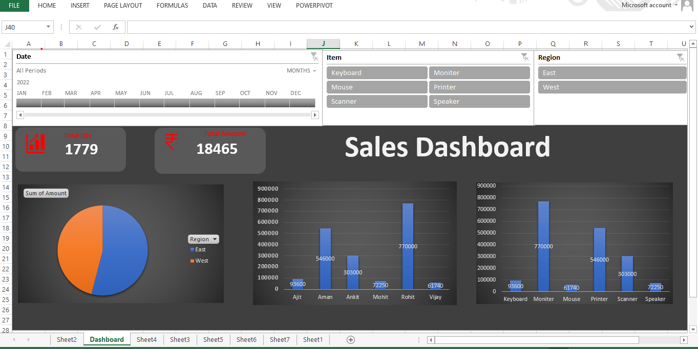

📊 Excel Sales Dashboard

This project is an interactive Sales Dashboard created using Microsoft Excel to analyze and visualize sales data.

🔹 Project Overview
The dashboard helps in understanding sales performance by using charts, KPIs, and filters. It allows users to quickly analyze sales by product, salesman, and region.

🔹 Features

Total Sales KPI

Total Quantity KPI

Sales by Product chart

Sales by Salesman chart

Region filter using slicers

Interactive dashboard

🔹 Tools Used

Microsoft Excel

Pivot Tables

Pivot Charts

Slicers

Data Visualization

🔹 Dashboard Preview

🔹 Author

Shweta Dhiman
